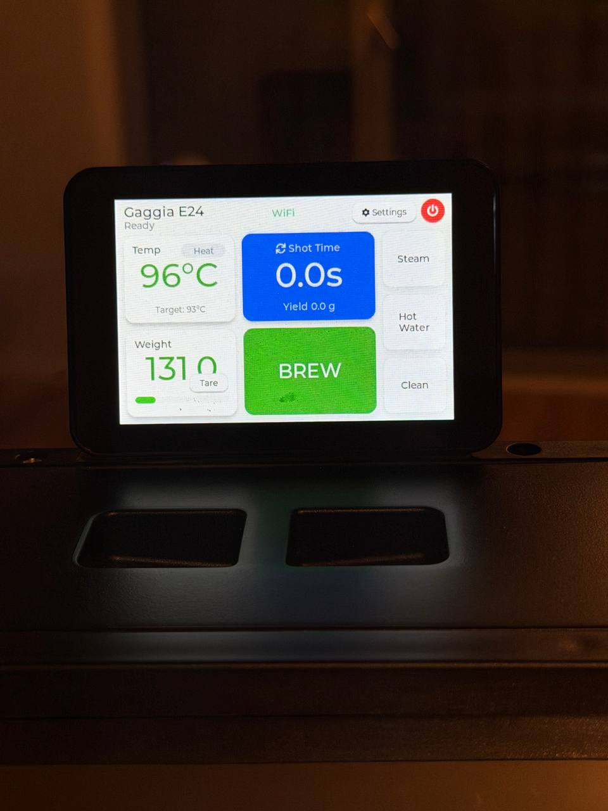
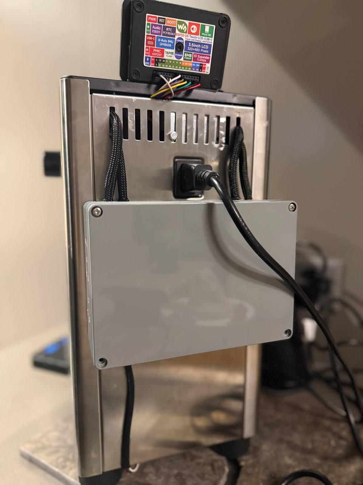
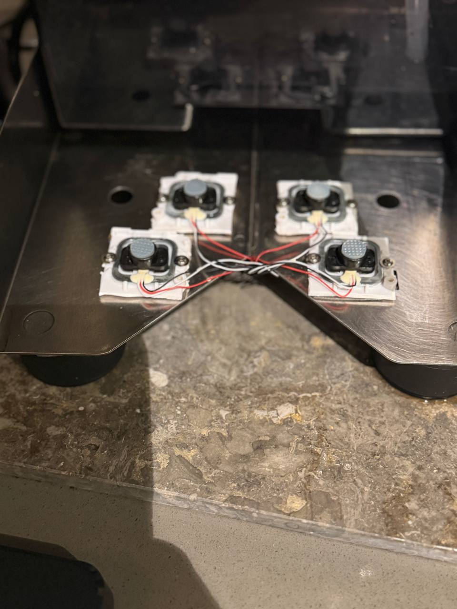

# FluxPresso — ESP32-S3 Espresso Controller

> **Complete hardware and firmware overhaul of a Gaggia Classic.**  
> Replaces analog thermostats and mechanical controls with a dual-PID embedded system running on a Waveshare ESP32-S3 module, featuring real-time gravimetric shot control, pressure profiling, WiFi telemetry, and a safety-critical architecture borrowed from industrial automation.

---

## What This Actually Does

A stock Gaggia Classic has a thermostat that oscillates ±5°C around target, no pressure control, and no feedback on yield. You pull shots blind. FluxPresso replaces all of that:

- **Temperature** is held to ±0.5°C via a PID loop driving a zero-cross-synchronized SSR
- **Pressure** is profiled across pre-infusion → bloom → extraction using a RobotDyn AC dimmer on the pump
- **Yield** is measured in real-time by a quad load cell scale reading through HX711 ADCs
- **Everything** is coordinated by a FreeRTOS state machine with hardware watchdogs

The result is an espresso machine that behaves like a commercial unit — repeatable, observable, safe.

---

## Hardware Stack

| Component | Part | Role |
|---|---|---|
| **MCU / Display** | Waveshare ESP32-S3-Touch-LCD-3.5B-C | Main controller + 3.5" 320×480 touchscreen |
| **SoC** | ESP32-S3 (Xtensa LX7 dual-core 240MHz) | FreeRTOS, WiFi, BLE |
| **Flash / PSRAM** | 16MB Flash + 8MB PSRAM | UI assets, data logging |
| **Thermocouple ADC** | MAX31855 + K-Type probe | ±0.25°C boiler temp, SPI |
| **Heater relay** | 40A SSR | Zero-cross switched, drives boiler element |
| **Pump controller** | RobotDyn AC Dimmer | Phase-angle control, drives vibratory pump |
| **Scale** | 4× HX711 + load cells (quad array) | Gravimetric shot control |
| **Real-Time Clock** | PCF85063 (on module) | Timestamped shot logs |
| **IO Expander** | TCA9554 (on module) | GPIO expansion for valve/aux |
| **PMIC** | AXP2101 (on module) | Power management, LV rail |
| **IMU** | QMI8658 6-axis (on module) | Vibration sensing (tamping detection) |
| **Audio** | ES8311 codec (on module) | Acoustic alerts |
| **Storage** | MicroSD slot (on module) | Shot profile export |
| **Enclosure** | Custom aluminum project box | Rear-panel mounted, HV/LV isolated |

## Photos

| Touchscreen UI | Rear Panel | Load Cell Array |
|:---:|:---:|:---:|
|  |  |  |
| Live temp, yield & brew controls | Waveshare ESP32-S3 + custom HV enclosure | 4-corner Wheatstone bridge scale |

---

> **Note on the scale:** Photo 3 shows a **4-corner quad load cell array**, not a single cell. Four cells are wired in a Wheatstone bridge configuration, connected to a single HX711. This cancels out placement bias — the reading is the same regardless of where the cup sits on the tray.

---

## System Architecture & Interdependencies

This is where the complexity lives. Every subsystem has upstream dependencies and downstream effects. Getting any dependency wrong cascades failures.

```
┌─────────────────────────────────────────────────────────────────────┐
│                        FluxPresso System                            │
│                                                                     │
│  ┌──────────────┐    ┌─────────────────────────────────────────┐   │
│  │  AC Mains    │    │            ESP32-S3 Core                │   │
│  │  (230V/50Hz) │    │                                         │   │
│  └──────┬───────┘    │  ┌─────────┐    ┌──────────────────┐  │   │
│         │            │  │FreeRTOS │    │  EspressoSM       │  │   │
│         ├──► SSR ───►│  │Scheduler│───►│  State Machine    │  │   │
│         │            │  └────┬────┘    └────────┬─────────┘  │   │
│         ├──► Dimmer──┤       │                   │             │   │
│         │            │  ┌────▼────┐    ┌────────▼─────────┐  │   │
│         └──► ZeroCross│  │ Tasks   │    │ States:          │  │   │
│              Detector─┘  │ • PID   │    │ IDLE → HEATING → │  │   │
│                          │ • Scale │    │ READY → BREW →   │  │   │
│  ┌───────────────┐       │ • UI    │    │ PRE-INFUSE →     │  │   │
│  │ MAX31855 SPI  │       │ • WiFi  │    │ BLOOM →          │  │   │
│  │ K-Type probe  │──────►│ • WDT   │    │ EXTRACT → DONE   │  │   │
│  └───────────────┘       └─────────┘    └──────────────────┘  │   │
│                                                                     │
│  ┌───────────────┐       ┌─────────┐    ┌──────────────────┐  │   │
│  │ HX711 (quad   │──────►│ Yield   │    │ DreamSteam       │  │   │
│  │ load cells)   │       │ Counter │    │ Controller       │  │   │
│  └───────────────┘       └─────────┘    └──────────────────┘  │   │
│                                                                     │
│  ┌───────────────┐       ┌─────────────────────────────────┐  │   │
│  │ LVGL 8.3 UI   │◄─────►│ WiFi / OTA / Telemetry          │  │   │
│  │ 3.5" Touch    │       └─────────────────────────────────┘  │   │
│  └───────────────┘                                              │   │
└─────────────────────────────────────────────────────────────────────┘
```

### Dependency Map

#### 1. Zero-Cross Detector → SSR + Dimmer (hardest dependency)
Both the heater (SSR) and pump (dimmer) are phase-angle devices. They can only switch cleanly at the AC zero-crossing point. The zero-cross interrupt (`GPIO 44`) is the heartbeat of all AC actuation:
- If zero-cross fails → heater can't switch → thermal runaway risk
- If zero-cross fails → dimmer can't modulate → pump runs at full pressure or not at all
- The sanity-check routine detects zero-cross absence and triggers a full system halt

#### 2. Thermocouple SPI → Both PID Loops (critical path)
The MAX31855 feeds temperature to both the Brew PID (target 93°C) and Steam PID (target 145°C). A single faulty reading propagates to:
- Heater duty cycle → if NaN, SSR opens fully (fail-safe off)
- `HEATING` → `READY` state transition (brew won't start until temp is stable within ±1°C of target)
- `DreamSteam` pump timing (steam boiler level management depends on knowing temp)
- The 165°C hard cutoff watchdog

The firmware guards against sensor disconnect by checking for `isnan()` on every read and triggering thermal runaway protection if consecutive bad readings exceed a threshold.

#### 3. EspressoSM → All Actuators (central orchestrator)
The state machine is the only entity that commands actuators. No task can write directly to a relay, pump, or valve — it must request a state transition. This enforces:

```
IDLE
 └─► HEATING      (heater ON, pump OFF, solenoid OFF)
      └─► READY   (temp stable, awaiting user)
           └─► BREW_START
                └─► PRE_INFUSE  (pump at low pressure, solenoid OPEN)
                     └─► BLOOM  (pump OFF, solenoid OPEN — pressure equalization)
                          └─► EXTRACT (pump at 9-bar target, solenoid OPEN)
                               └─► DONE (pump OFF, solenoid CLOSED, yield logged)

READY └─► STEAM   (PID target switches to 145°C, DreamSteam takes over pump)
```

Each transition has **guard conditions** — pre-conditions that must be true for the transition to fire. For example, EXTRACT will not start until PRE_INFUSE has run for the configured duration AND pump pressure has stabilized.

#### 4. HX711 Scale → Shot Termination + UI
The 4-corner load cell array feeds the `yield_g` variable. This creates a feedback loop:
- `yield_g` increments as espresso flows into the cup
- When `yield_g >= target_yield_g` → triggers automatic DONE transition
- `yield_g` is displayed live on the UI (the "Yield 0.0g" readout in photo 1)
- Tare is applied on brew start (the "Tare" button zero-resets before each shot)

**Why 4 cells?** A single load cell under the tray gives wildly different readings depending on where you place the cup. Four cells in a mechanical bridge average the measurement and eliminate the lever-arm error.

#### 5. DreamSteam → Pump + Heater Interlock
Standard PID mods neglect the pump during steaming. When you steam milk after pulling a shot, the boiler water level drops as steam exits — eventually you get dry steam or no steam at all. DreamSteam solves this by:
1. Monitoring boiler temp during steam mode
2. When temp dips below a pressure threshold (steam pressure proxy), it briefly pulses the pump
3. The pulse refills the boiler but uses the thermal mass to avoid steam pressure collapse
4. Critically: pump pulses are timed to NOT interfere with the wand pressure during active steaming

This requires the state machine to expose a `STEAM_PULSE` sub-state that the DreamSteam controller can request without leaving the STEAM state.

#### 6. Hardware Watchdog → All Outputs (last line of defense)
A 500ms WDT timer is kicked by the main FreeRTOS task on every healthy loop. If the MCU hangs (task starvation, stack overflow, memory fault), the WDT fires and:
- Cuts power to the SSR → heater off
- Forces pump dimmer to 0% → pump off
- Triggers a full MCU reset

This is why `WDT_KICK` must appear in every time-critical task. Missing it under heavy UI load or WiFi activity is a real bug vector.

---

## Pin Configuration

*Defined in `src/project_config.h`*

| Signal | GPIO | Notes |
|---|---|---|
| Heater (SSR) | 16 | Digital out, active-high |
| Pump PWM (Dimmer) | 43 | Analog PWM to dimmer module |
| Zero-Cross input | 44 | Interrupt, pulls both SSR and dimmer timing |
| Solenoid Valve | 5 | Digital out, active-high |
| Thermocouple CS | 6 | SPI chip-select |
| Thermocouple DO | 7 | SPI MISO |
| Thermocouple CLK | 15 | SPI clock |

---

## Build & Flash

### Prerequisites
- PlatformIO (VSCode extension or CLI)
- Libraries auto-installed via `platformio.ini`: LVGL 8.3, Adafruit MAX31855, HX711

### Flash
```bash
pio run -e esp32-s3-devkitc-1 -t upload
```

### Calibration
1. Set `SCALE_CALIBRATION` in `app_config.h` with a known reference weight (e.g., 100g calibration mass)
2. Confirm `GRID_FREQ_HZ` is `50` (Europe/CH) or `60` (US) — this directly sets the zero-cross timing for the pump dimmer
3. PID coefficients (`KP`, `KI`, `KD`) can be tuned in `app_config.h` without reflashing if using the Settings UI

---

## UI Walkthrough

The LVGL 8.3 interface (photo 1) shows:

| Element | Source | Updates |
|---|---|---|
| `96°C` (green) | MAX31855 SPI read | Every 200ms |
| `Target: 93°C` | `app_config.h` / Settings UI | On user change |
| `Heat` toggle | SSR state | Reflects PID output |
| `Shot Time 0.0s` | FreeRTOS timer, starts on BREW | Every 100ms |
| `Yield 0.0g` | HX711 scale task | Every 200ms |
| `Weight 131.0g` | HX711 raw (pre-tare) | Continuous |
| `BREW` button | Triggers `BREW_START` event | Latched green when brewing |
| `Steam / Hot Water / Clean` | Mode select buttons | Trigger state transitions |

---

## Interactive Wiring Diagram

The full wiring diagram with HV/LV isolation zones, component placement, and annotated connections is available as an interactive HTML page:

**[→ Open Wiring Guide](https://kamelch.github.io/FluxPresso/Diagram_index.html)**

---

## Safety

> ⚠️ **This project modifies mains-voltage (230V) equipment. If you are not qualified to work with high-voltage AC systems, do not attempt this modification.**

Design decisions made specifically for safety:

- **HV/LV isolation:** All 230V traces and wiring are physically separated from the 3.3V/5V logic circuits. The custom enclosure (photo 2) routes HV cables through the left side and LV through the right, with braided sleeves on both
- **165°C hard cutoff:** A firmware-level threshold that opens the SSR regardless of PID output. This is checked synchronously in the zero-cross ISR — it cannot be blocked by a hung task
- **WDT on all outputs:** 500ms watchdog means no output can stay latched if the CPU hangs
- **NaN guard on thermocouple:** Disconnected or shorted K-type probe reads as NaN. Any NaN reading triggers immediate heater shutdown
- **Zero-cross sanity:** If >200ms passes without a zero-cross interrupt, the firmware flags a fault and opens all relays

---

## License

Apache 2.0 — see `LICENSE`.
